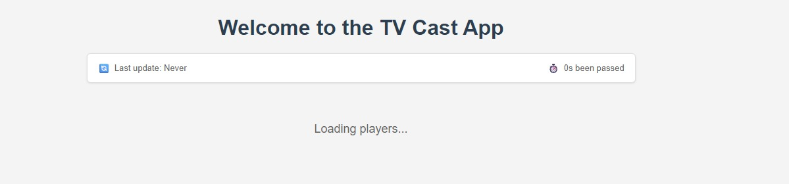
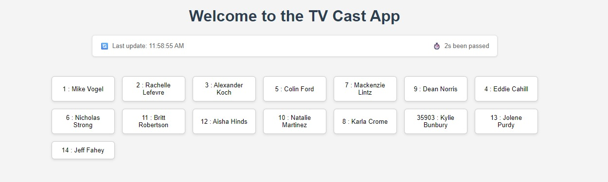
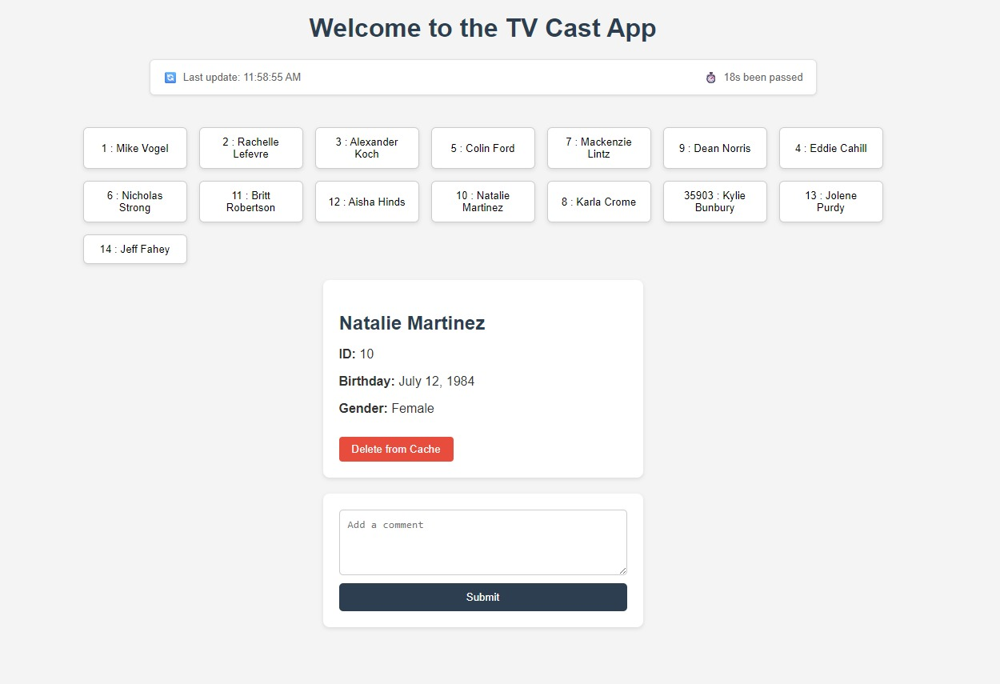

# TV Cast App

A React + Node.js application for managing TV show cast data with caching and real-time updates.

## Features

- **WebAPI Service**: Integration with TV Maze API for cast data
- **Cache System**: 5 minute cache with automatic refresh 
- **Real-time Updates**: Socket.io integration for live cache synchronization
- **Player Management**: View, select, and delete players from cache
- **Comment System**: Add comments to players with file storage
- **Status Monitoring**: Real-time timer showing cache freshness
- **Preloading**: Cache initialization on server startup
- **Modular Architecture**: Separation of concerns with service layer pattern
- **Error Handling**: Comprehensive API error management
## Screenshots

### Loading State


_Initial loading screen with status bar showing cache state before data fetch_

### Player List


_Main interface displaying cast members with real-time status updates_

### Player Details & Comments


_Selected player details with comment form and cache management_

## Architecture

### Backend (Node.js + Express)

- **API Routes**: RESTful endpoints for cast data
- **Cache System**: In-memory cache with TTL and auto-refresh
- **Socket.io**: Real-time communication for cache updates
- **File Storage**: Comment system with TXT file persistence

### Frontend (React)

- **Components**: Modular architecture with PlayerList, PlayerDetails, CommentForm
- **State Management**: React hooks for data and UI state
- **Real-time Updates**: Socket.io client for live synchronization
- **Status Bar**: Timer showing cache freshness and last update time

## Performance & Benefits

- **Reduced API Calls**: Intelligent caching minimizes external requests
- **Real-time Experience**: Instant updates across all connected users
- **Scalable Design**: Easy to extend with database or Redis integration

## Setup

### Backend

```bash
cd backend
npm install
npm start
```

### Frontend

```bash
cd frontend
npm install
npm run dev
```

## Technologies

- **Frontend**: React, Socket.io-client, Axios
- **Backend**: Node.js, Express, Socket.io, Axios
- **Cache**: In-memory with TTL (5 minutes)
- **Storage**: File-based comment system

## API Endpoints

- `GET /api/cast` - Get all cast members
- `DELETE /api/cast/:id` - Delete player from cache
- `POST /api/cast/add-comment/:id` - Add comment to player

## Real-time Features

- **Cache TTL Updates**: Automatic refresh every 5 minutes
- **Live Status Bar**: Timer showing time since last update
- **Instant UI Updates**: Real-time synchronization via Socket.io
